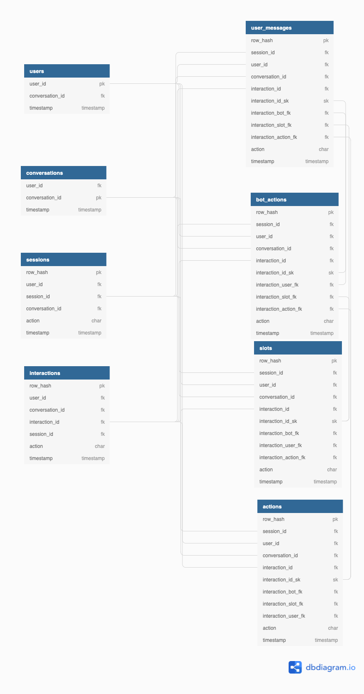

# Chat Analytics Semantic Schema

## Running DBT Package
In order to run the package, you must supply environemnt variables defining access to Redshift. The documentation is provided [here](https://github.com/scale-vector/rasa_data_ingestion_deployment/blob/master/autopoiesis/DEPLOYMENT.md#redshift-access). You can also use the [.env](.env) file as an example.
The prefix of the schemas from which packages takes and writes data must be supplied from command line.
Following example
```
env $(cat .env | grep "^[^#;]" | xargs) PG_PASSWORD=... dbt run --profiles-dir . --vars "{source_schema_prefix: carbon_bot_eks, compat_old_session_gap_minutes: 60}" --fail-fast
```
1. applies environment variables from `.env` file
2. overwrites password value
3. runs the package incrementally for the `carbon_bot_eks` schema prefix, it also breaks sessions every 60 minutes (as carbon bot contains a lot of old data)

Alternatively you can apply the variables from the .env file to the shell and use `dbt run`.

### Running in Production
1. install dependencies (package uses `dbt-expectations` for testing)
```
dbt deps --profiles-dir .
```
2. update seeds
```
dbt seed --profiles-dir . --vars "{source_schema_prefix: jm_eks}"
```
3. test if raw schema (`event`) was created (or have the package fail on non existing tables)
```
dbt test --profiles-dir . --vars "{source_schema_prefix: jm_eks}" -s source:*
```
will return non 0 exit code if fails

4. run the package incrementally
5. optionally run tests

## Package customizations
Package can be customized as follows:

### External user and session ids
Package allows to use a field passed in `metadata` of `user` or `session_start` event as user identifer. The default is to use `sender_id` as such. The table `users` is built upon the `user_id` passed and such *user id* is present in `sessions` and `interactions` table.

In the same way, additional session identifier can be passed. Such session identifier may be for example used to correlate session between web/mobile app and a bot. The default external session id is `sender_id`.

The columns names for user and external session ids may be configured in `dbt_project` or by passing the variables in command line

```
dbt run --profiles-dir . --vars "{source_schema_prefix: jm_eks, user_id: metadata__use
r_id, external_session_id: metadata__mitter_id}" --fail-fast
```

### Configuring special intents and actions
Package can provide information on 

1. intents that start a story
2. intents that indicate that user is frustrated or angry
3. actions that indicate handoff to agent (and can be used to measure containment rate)
4. intents that indicate that user disputes the resolution of the scenario
5. intents that indicate that user is happy with the service

All of those can be set up via seeds or `dbt_project` variables.

## Loads lifecycle and `_loads` table
Package identifies new data by finding all load identifiers in `_loads` table in `event` schema that have only one entry with status 0.

On the successful processing new records are inserted with status = 1.

### Full Refresh
Full refresh will take all the existing distinct loads from the `_loads` table.
[dbt docs](https://docs.getdbt.com/docs/building-a-dbt-project/building-models/configuring-incremental-models#what-if-the-columns-of-my-incremental-model-change)
```
env $(cat .env | grep "^[^#;]" | xargs) PG_PASSWORD=... dbt run --full-refresh --profiles-dir . --vars "{source_schema_prefix: jm_eks}" --fail-fast
```
## Seeds

## Schemas


### Source: Raw data schema (the source of the dbt package)


Any additions to the bot model data will immediately propagate to this schema. 

The raw data schema is a self-updating, autogenerated schema for the events designed for instant iteration, created by recursively unpacking the tracker json.

This allows creation of simple analyses without any additional effort.

To enable more complex analyses, this data is processed into a semnatic schema that rebuilds state. This semantic schema is fully customisable to your business' logic via the dbt model.


### Semantic schema



