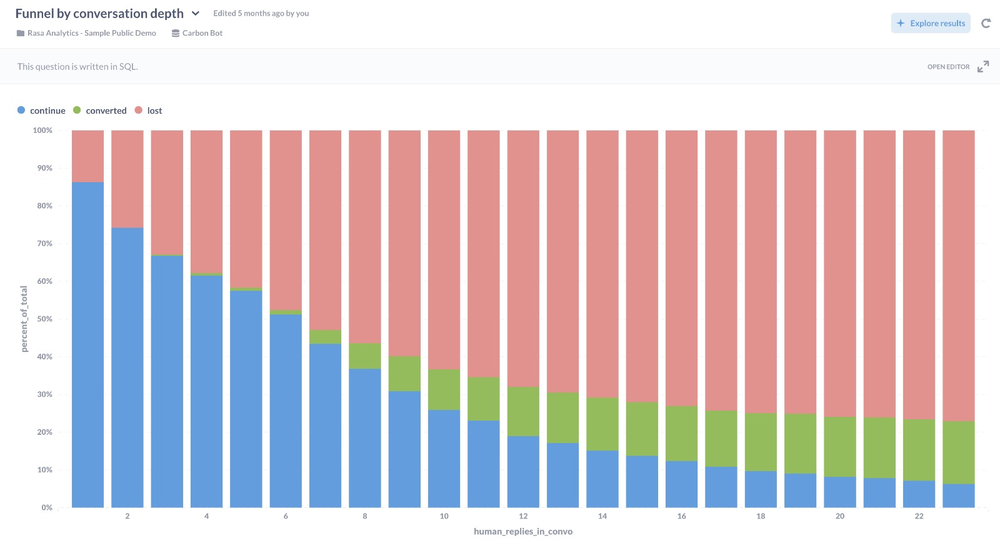
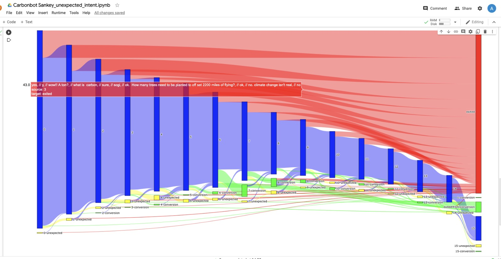

## Schemas

### Source: Raw data schema (the source of the dbt package)

Any additions to the bot model data will immediately propagate to this schema. 

The raw data schema is a self-updating, autogenerated schema for the events designed for instant iteration, created by recursively unpacking the tracker json.

This allows creation of simple analyses without any additional effort.

To enable more complex analyses, this data is processed into a semnatic schema that rebuilds state. This semantic schema is fully customisable to your business' logic via the dbt model.

### Semantic schema

The semantic schema contains 2 types of tables - Event tables and stateful entity tables
#### event tables:
- user messages: this table contains the user messages
- bot messages: This table contains the bot messages and actions
- slot request &fill: This table records the request and filling of slots
- story actions: Like the slot table for the setups that use stories instead of slots

#### stateful entity tables

The stateful entity tables are cumulative aggregations that calculate the state of the entity so we can use it in the context of events. For instance, we can look at a user message in the context of the conversation state and outcome (handover, conversion, etc)

- Interaction
- Session
- Conversation
- Custom user implementation: User

## Usage

The semantic schema is designed for several access patterns depending on the entity studied.
### 1. Event centric

In an event centric analysis, the event is the "fact" and the dimensions are the context of an event:
- The conversation it is part of (start, end, completion state)
- The session it is part of and its details (start, end, completion state)
- The interaction that the event is part of and what else happened during it (for instance if information was collected succesfully)
- The story (start, end, completion state)
- The event content description (intent)
- The cause and the outcome (previous dialogue message, next dialogue message)
- The position of the event in the conversation (landing, exit, scenario etc)

This access pattern is particularly helpful in answering qualitative questions such as 
- "what was the last user reply in the conversation"
- "What happened just before the user got frustrated?"
- "what the user say [perhaps in response to something]" 
- "why did the handover happen"
- "what happened before the bug occurs"

To answer these questions, we start our analysis from one of the event tables and gather context by joining via foreign keys:
- Join the event table (such as human utterance) to the stateful entity table (session, interaction, conversation)
- Join to other events tables via interaction id that is used as a foreign key. (n:n join, an interaction can have multiple events of the same type)

These joins can be done via 
- ID to the entity table (eg, interaction id)
- Interaction foreign key ("_fk" notation) to the event tables. Some foreign keys are offset to the before/after interaction such as "previous_interaction_bot_fk" which signifies that this is an interaction id meant to join to the bot actions (table) of the preceding interaction.

#### examples:
- Funnel in metabase

- Sankey intent diagram
https://colab.research.google.com/drive/1Dpeql0YyAtaTxa_NMdustZiWdNd0tQjo#scrollTo=Rw4gO-rw0igE

### 2. Stateful Abstraction centric

An interaction (or other abstraction) centric analysis supports quantitative analyses better than an event centric analysis. 

This is because the interaction is the smallest "stateful" unit of data that we can look at as having an "outcome" or "success" state.

Specifically, an interaction is the conversation segment that starts with a human utterance and ends before the start of the next one.

If the interaction is a fact, then the metrics are
- quality metrics for the interaction such as error rate, unhappy rate etc (count of interactions containing an event of a certain type)/(count of all events)
- count of interactions (how many "steps" or "interactions" or "exchanges"). We could look at totals or break them down by things like intents, or scenarios, to understand how many exchanges per scenario etc
- count (distinct) of higher aggregation entities (sessions, conversations, users)

The same logic allows for 
- session centric or conversation centric 
- in custom scenarios, user or story centric

This access pattern is particularly helpful in answering quantitative questions such as 
- Funnels that can be split by outcomes (states)
- how many interactions are in a scenario conversation
- How many conversations are in what state
- How many interactions were bounces

### tables:
#### Dialogue event tables:

-  user_messages: Contains references to the encapsulating entity (interaction, session,conversation, users), and to the previous and current (following) bot messages

-  bot actions: Contains references to the encapsulating entity (interaction, session,conversation, users), and to the current (preceding) and next bot messages

#### Scenario event tables:
- slots: captures story events depending on your bot config. Can be used for scenario funnels or we can refer to it from other events.
- actions: same as slots depending on bot implementation.

#### Stateful entity tables:

All stateful tables act as descriptors for the less aggregated data. 

This allows you to analyse events or interactions in the context of the state of the aggregate entity.

Specifically, you can this way look at interaction in the "success context/state" of the conversation.

- interaction: An interaction is the smallest unit with state (such as parsing success), and represents a dialogue exchange along with all technical events that happen during.
- sessions: A higher aggregation of interactions, delimited by a time without actions (configuralble) or a custom event such as "session start"
- conversations: Like sessions but using the rasa sender id
- users: Custom: Like conversations but using a custom user id sent by you

#### glossary:
* Facts - Things that happen such as events or sales, we can sum or count them. (example: sales_value, message_id)
* Metrics - Sum, count, or a custom aggregation of facts. Example: "total sales" as sum of sales_value, "messages" as count of message_id)
* Dimensions - Descriptive attributes of a fact that can be used to break down dimensions by (source, time, context, bot version, etc) Example : Source, as in count of messages by *source*
and their dimensions as descriptive attributes in a n:1 relationship.

