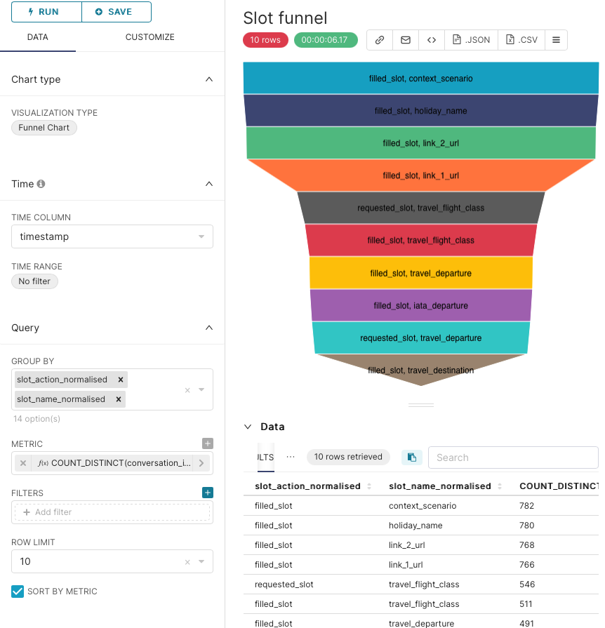
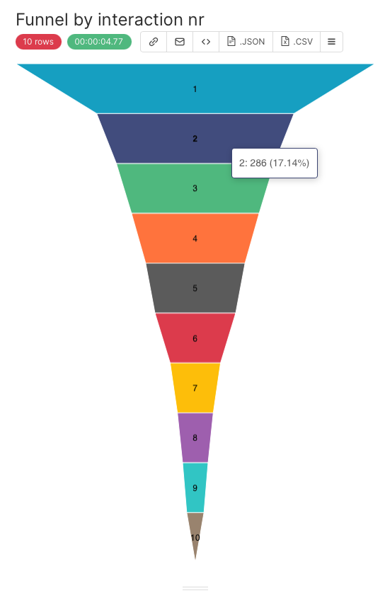

## Funnels consist of
 - a metric (count of entity scuh as users or conversations),
 - a dimension: Funnel step - here we use something lke the event name/type or the interaction nr
 
 The funnel order may be sorted by step nr or by the metric (as a funnel is always sorted descending by metric)

### examples:

### Slot actions funnel - All slot events, requests and fills 
(optionally could filter by event type)
```
SELECT slot_action_normalised AS slot_action_normalised,
       slot_name_normalised AS slot_name_normalised,
       count(DISTINCT conversation_id) AS "COUNT_DISTINCT(conversation_id)"
FROM carbon_bot_eks_views.slots
GROUP BY slot_action_normalised,
         slot_name_normalised
ORDER BY "COUNT_DISTINCT(conversation_id)" DESC
LIMIT 10;
```
Image from superset: 



### Interaction funnel - how many conversations are retained until which step?
```
SELECT interaction_nr AS interaction_nr,
       count(DISTINCT conversation_id) AS "COUNT_DISTINCT(conversation_id)"
FROM carbon_bot_eks_views.user_messages
GROUP BY interaction_nr
ORDER BY "COUNT_DISTINCT(conversation_id)" DESC
LIMIT 10;

```
Image from superset: 



